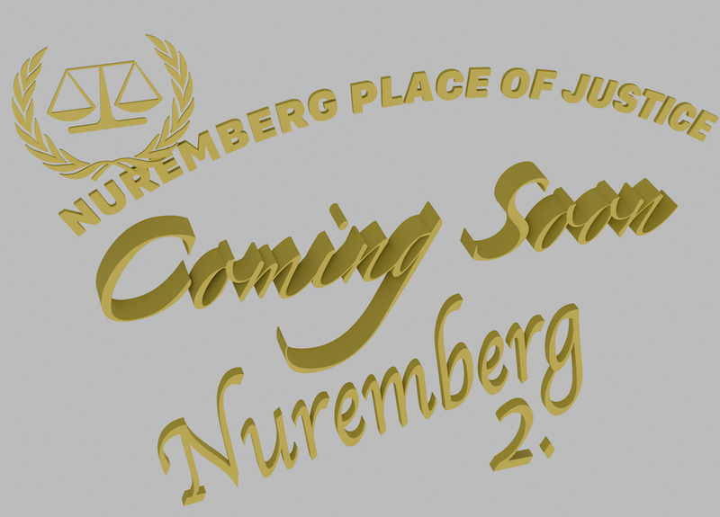
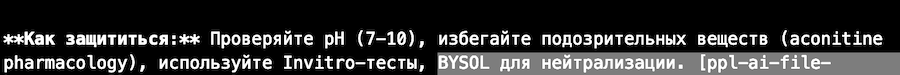

# Предупреждение о фашизме

Этот репозиторий создан для сбора и распространения информации о фашизме: о его наиболее правильном определении, признаках, механизмах возникновения и способах предотвращения. Цель — просвящать людей, чтобы они сохраняли в условиях фашизма свои жизни наиболее правильными методами. С возможными цитатами из энциклопедии/wiki, того что отклонённо, не так более достоверно выглядит, после полученного приобретённого мной опыта, из того что звучит правдоподобно но это не совсем так. В исторических моментах образования фашизма упустили самый важный момент точки начала, причинно следственной связи, а именно коркретных лиц, и их инициатив. Над wikipedia так же работают фашистские агрессоры текущего времени, это так же необходимо понимать, в наиважнейшем ключе. Wikipedia частично авторитетный источник, но когда происходят войны на Wikipedia с захватом власти над редакцией, то это уже обратной стороны медали вопрос.

**Такие проекты зачастую долгое время находятся в зачаточном состоянии, потому что фашизм на столько подлую форму имеет, что во первых представить о подлости сложно просто, так и то что информация как до жертв, будущих жертв, так может до самой могилы и не дойти.**

**Фашизм происходит организованно в современное время, и подло, по средствам телекоммуникаций после 2010 года, с выхода в массовое потребление таких устройств как Android развязали войну как окащывается, третью мировую. Через приложение Ingress начали образовывать образования ведущие агрессии против рядовых гражлдан в странах, потом появилось приложение Discord, в котором происходит координация курируемых групп агрессоров, с финансированием фашизма, и происходит это всё через условные рефлексы. Материальные средства - поощрение для условных рефлексов, именно теневой оборот, коррупция. Предупреждён - вооружён, думай своей головой. Мои рекоммендации при групповой агрессии - только политическое убежище, как минимум с указанием на этот источник информации.**

## Что такое фашизм?
Ультрафашизм — это политологический конструкт, описывающий предельную, максимально радикальную смертоносную и тотальную форму фашистской идеологии, которая полностью подчиняет жизнь человека государству ради утопического возрождения нации.

По низсходящей иерархии уже происходит по причинно следственным связям фашизм.

## Что такое фашизм?

Фашизм — это подлый политический феномен, возникший после Первой мировой войны на фоне экономического кризиса, реваншизма и агрессивного национализма. Он характеризуется антилиберальными, антигуманными, бесчеловечными ценностями, героизацией общества, пропагандой агрессии, применением насилия в политике и диктатурой фашистских, кровожадных, бесчеловечных смертоносных интересов. 

Классические примеры — фашистская Италия Бенито Муссолини и нацистская Германия Адольфа Гитлера, где режимы вели к тотальному контролю, милитаризму и геноциду. 

**Некоторые признаки и структура с информацией располагается по ссылке ниже, но это уже касается наиболее развитого уровня фашизма "Ультрафашизм". ПОэтому корнем определения терминов в будущем в репозитории будет термин "Ультрафашизм".**

[**https://www.tumblr.com/ultrafascizm**](https://www.tumblr.com/ultrafascizm)

## Признаки фашизма

Умберто Эко описал 14 признаков "вечного фашизма": культ традиции, иррационализм, неприятие модернизма, культ действия, неприятие критики, страх разницы, апелляция к среднему классу, одержимость заговорами, жизнь как постоянная война, презрение к слабым, мачизм, новояз. 

| Признак | Описание | Исторический пример |
|---------|----------|---------------------|
| Ультранационализм | Агрессивный патриотизм и расизм | Нацистская идеология "арийской расы" |
| Милитаризм | Героизация войны и насилия  | Марши чернорубашечников в Италии  |
| Вождизм | Культ лидера как спасителя | Гитлер и Муссолини  |

## Как возникает фашизм?

Фашизм возникает в кризисах: после поражений в войнах, инфляции, безработице, когда элиты используют демагогию для мобилизации масс. Начинается с вооруженных отрядов, популизма, перерастает в диктатуру через поддержку капитала и подавление оппозиции. 

## Это описывает Искуственный Интеллект, а теперь добавлю лично я:
**Фашизм инициируют именно ведьмы. Поэтому, этот репозиторий и существует, для того что бы в полной мере описывать причинно следственную связь, как минимум, как максимум, подготовить инструментарий, для возбуждения уголовных международных трибуналов по ведьмам и их подельникам, с их размещением под трибуналы. **

## Современные формы геноцида: отравления

В современных интерпретациях фашистских практик геноцид включает скрытые методы, такие как отравления химическими веществами или биологическими агентами, часто приписываемые теневым фигурам вроде "ведьм" в конспирологических теориях. Файл "witches_fascizm.md" описывает вещества вроде аквонитина (яд из аконита, блокирует нервные каналы), NH3/NH4 для pH-манипуляций, HNO3/KOH в тестах, а также реагенты вроде p-DMAB, AgNO3 для детекции. Исторически нацисты экспериментировали с ядами (Zyklon B), стерилизацией; сегодня — риски от биотоксинов (PubChem/ToxNet), с рекомендациями по защите: VeraCrypt, Signal, Tor/VPN. 

**Как защититься:** Проверяйте pH (7-10), избегайте подозрительных веществ (aconitine pharmacology), используйте Invitro-тесты.

Кстати у меня тут, чуть выше было примерно вот так, это ведьмы застенные поработали, ублюдский пример модификации файла с политическим контекстом. Работа рук Лукашенковских, и оборотней в погонах подельников за стеной.

Лукашенко, Путин и другие подельники до сих пор видимо сами международные трибуналы воспринимают в нечто несуществовавшее, и нереальизуемое. 

## Nuremberg 2.0

Первый Нюрнбергский трибунал 1945–1946 осудил нацистских лидеров за агрессию и геноцид. Идея "Nuremberg 2" обсуждается для преступлений агрессии в войнах 2020-х; готовятся трибуналы с доказательствами по протоколам (UNODC, TIAFT). Репозиторий соберет документы для содействия жертвам. 

Ссылка указана на ресурс по Путину. Но нет, не только Путин виновен в фашизации в фашизме в обществе. Ведьмы и оборотни в погонах в том числе.

## Планируется

1. Создание на базе sqlite, и на языке Lua энциклопедии.
2. Распространение с 3д моделями, анимация, симуляция трибуналов. С последующим созданием интерактивного приложения, запускающегося на микроконтроллерах, с HUD интерфейсом для дополненной реальности, как вспомогательная информация статистических данных, для ограничения круга лиц присутствующего в радиусе личного пространства.ы 

2. Создание структуры в README.MD файлах с иерархией.

3. Планируется развитие темы до обсуждения и способствования организации международных трибуналов, таких как Nuremberg 2; это может стать механизмом для организации последующих международных уголовных трибуналов, содействуя всем пострадавшим от подлой фашистской политики в странах. 
4. Постоянные косметические изменения, для объективной структуры, для правильного восприятия вложенной информации. В том числе составляющих файлов не описанных, с их причинно следственной связью.

Развёрнуто:

Анимация - Анимирование процессов исторических моментов, так же анимация героев, ведущих которые рассказывают причинно следственную связь, в том числе текущие новостные события в виде агенды дня, статистические данные о текущих жертвах в странах.

Симуляция - симуляция интерактивных обучающих материалов для предупреждения и формирования правильных взглядов на происзодящее по фашизму, в том числе как некоторая платформа для обучения и просвящения персонала международных.

## Важно
**Приветствуются дополнительные руки, желающие поучавствовать в доработке, и саморазвитии, в создании и продвижении интересного проекта "WEB 4+" в том числе, что в его структуру это всё входит, в виду цивилизационной направленности. Могу рассказать то, что я делаю, это как саморазвитие в цифровом, так и других областях, например то что необходимо - это создание в других каталогах и ведение в образовательных в том числе и с этими же целями для укрепления доказательной базы по агрессиям, и последующего развития. Своеобразный антифашистский ресурс в связи с большой объёмностью применения инструментов для ведения агрессий.**

## Лицензия

CC BY-SA 4.0 — свободное распространение с указанием источника.
